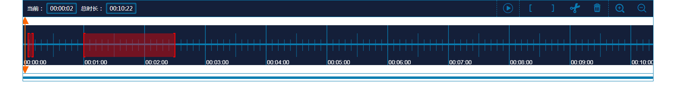

# 视频播放时间轴插件

>作者：a-ke

## 安装说明
1. 使用script引入   
将此文件夹放到静态目录下，在html文件中引入TimeScale.js即可。例如
```html
<script type="text/javascript" src="/static/plugin/timescale/TimeScale.js"></script>
```
2. import 引入   
需要提前引入timescale.css和konva.min.js两个文件。实例：
```javascript
import 'timescale/css/timescale.css'
import 'timescale/js/konva.min.js'
import 'timescale/TimeScale.js'
```

## 使用说明
1. 首先在html中设置一个div，如下：
```html
<div id='timescale'></div>
```
2. 使用<mark>render</mark>函数初始化
```javascript
var sectionArr = [{
  id: 1, //视频id,唯一标识
  duration: 312000 //当前视频的时长
}, {
  id: 2,
  duration: 300000
}, {
  id: 3,
  duration: 10000
}];
var clipsArr = [{
  startTime: 0,  //剪辑片段的开始时间
  endTime: 5000  //剪辑片段的结束时间
}, {
  startTime: 10000, 
  endTime: 60000
}, {
  startTime: 150000, 
  endTime: 612000
}];
var timeLine = timescale.render({
  ele: 'timescale', //插件要渲染的元素的id
  sectionArr: sectionArr, //视频片段信息
  clipsArr: clipsArr, //视频剪辑片段信息
  // backgroundColor: '#a0a0a0', //插件背景颜色（可选）
  // fontColor: '#333', //插件字体颜色（可选）
  // iconColor: '#333' //插件图标颜色和刻度颜色（可选）
});
```
3. 初始化完成后，插件效果如下：   



## 插件方法说明
1. play()   
控制插件工具条上的播放按钮切换为播放状态
2. pause()   
控制插件工具条上的暂停按钮切换为暂停状态
3. seekTo(time)   
控制游标移动到指定的时间，time为要跳转到的时间，单位为毫秒
